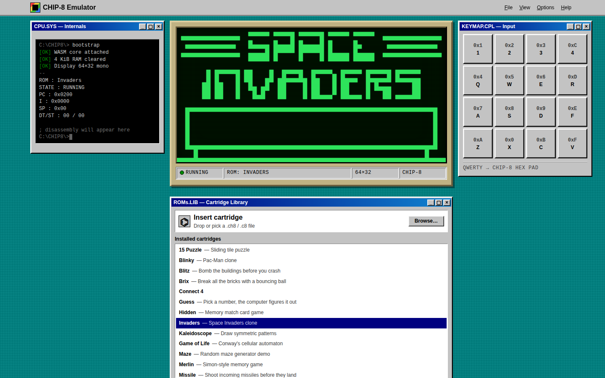

# chip8-v2

A CHIP-8 emulator written in Rust, compiled to WebAssembly, and run in the browser behind a Win9x-style SolidJS frontend.



## What is CHIP-8?

CHIP-8 is not real hardware. It is a small interpreted language/virtual machine created by Joseph Weisbecker in the mid-1970s so games could be written once and run on hobbyist microcomputers like the COSMAC VIP. Its tiny spec makes it the traditional "first emulator" project:

- **4 KiB of RAM**, with programs loaded at `0x200` and a built-in hex font below that
- **16 8-bit registers** (`V0`–`VF`, with `VF` doubling as a carry/collision flag), a 12-bit index register `I`, a program counter, and a small call stack
- **35 two-byte opcodes** covering arithmetic, jumps, subroutine calls, key input, and sprite drawing
- **A 64×32 monochrome display** where sprites are XOR-drawn, so drawing over a lit pixel turns it off and reports a collision
- **Two 60 Hz timers** (delay and sound) and a **16-key hex keypad**

Emulating it comes down to a loop: fetch two bytes at the program counter, decode the opcode by its nibbles, execute it against the machine state, and repeat at some clock rate. Around that loop you tick the timers at 60 Hz, redraw the screen when it changes, beep while the sound timer is non-zero, and map keyboard keys onto the hex keypad.

## What this project does

- **`chip8-core/`** is a pure-Rust, platform-agnostic interpreter with no dependencies. It owns memory, registers, the fetch/decode/execute cycle, timers, and the framebuffer. `Emulator::tick(delta_ms)` runs as many CPU cycles as fit in the elapsed time (500 Hz by default) while decrementing the timers at a fixed 60 Hz. Randomness is injected through a `RandomSource` trait so the core stays testable.
- **`chip8-wasm/`** is a thin `wasm-bindgen` wrapper that exposes the core to JavaScript as a `Chip8` class. It supplies a `getrandom`-backed RNG and packs each tick's "screen updated" and "sound active" flags into a single `u32` so JS gets both without an extra call.
- **`www/`** is the SolidJS + Vite frontend. A `requestAnimationFrame` loop feeds frame deltas into `tick`, draws the framebuffer to a `<canvas>`, and maps a QWERTY block (`1234 / QWER / ASDF / ZXCV`) onto the hex keypad. You can pick from 24 bundled classic ROMs or load your own `.ch8` file.

## Tech stack

| Layer | Tools |
| --- | --- |
| Emulator core | Rust 1.85 (edition 2024) |
| Wasm bindings | `wasm-bindgen`, `wasm-pack`, `getrandom` |
| Frontend | SolidJS, TypeScript, Vite |
| Testing / linting | `cargo test`, Clippy, rustfmt, Vitest, ESLint |
| CI | GitHub Actions: path-filtered Rust and web jobs, plus a weekly `cargo audit` / `npm audit` |

## Getting started

You need Rust (the toolchain is pinned in `rust-toolchain.toml`), Node 22, and `wasm-pack`.

```sh
just dev
# or, without just:
wasm-pack build chip8-wasm --target bundler
cd www && npm install && npm run dev
```

See [CONTRIBUTING.md](CONTRIBUTING.md) for the full check suite, the pre-commit hook, and how CI is set up.

## Additional Resources

- [Cowgod's CHIP-8 Technical Reference](http://devernay.free.fr/hacks/chip8/C8TECH10.HTM): the classic opcode-by-opcode spec
- [Guide to making a CHIP-8 emulator](https://tobiasvl.github.io/blog/write-a-chip-8-emulator/) by Tobias V. Langhoff: a walkthrough that explains the design without handing you code, and covers the quirks that differ between interpreters
- [Timendus' CHIP-8 test suite](https://github.com/Timendus/chip8-test-suite): ROMs that check opcode correctness and quirk behavior
- [Octo](https://johnearnest.github.io/Octo/): a browser-based assembler and IDE for writing your own CHIP-8 programs
- [CHIP-8 Archive](https://johnearnest.github.io/chip8Archive/): a curated collection of modern, openly licensed CHIP-8 games
- [kripod/chip8-roms](https://github.com/kripod/chip8-roms): a large collection of classic games, demos, and programs
